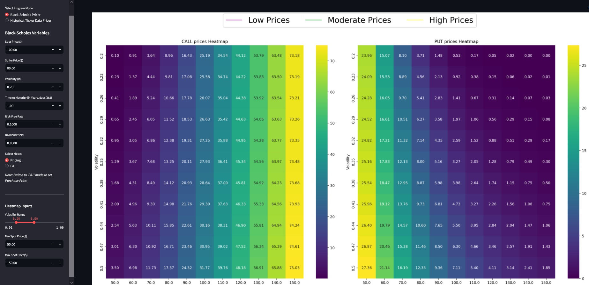
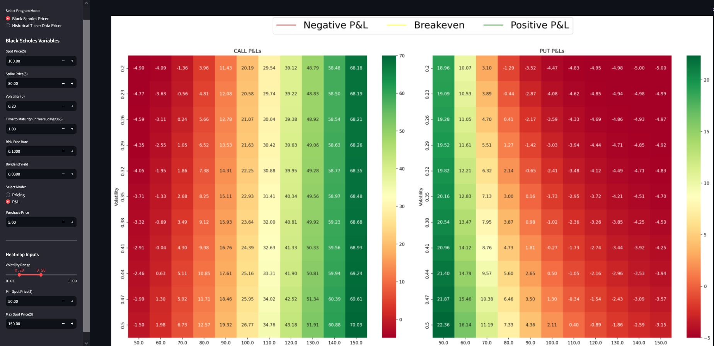
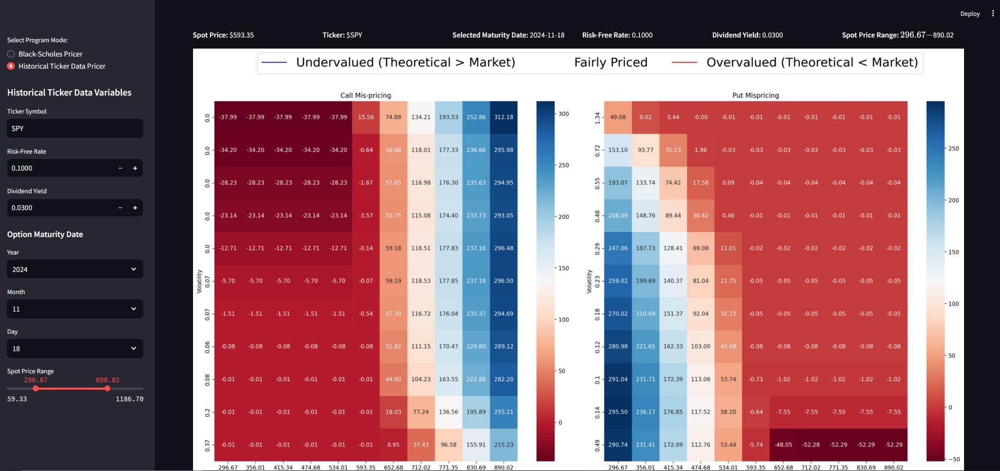

# Interactive Black-Scholes Option Pricing App

An interactive **Streamlit app** that provides a comprehensive tool for analyzing options pricing, profit & loss (P&L), and mispricing using the Black-Scholes model. The app integrates theoretical pricing with real market data to help users make informed decisions about options trading.

---

## Features

### 1. **Pricing Heatmaps**
- Visualize theoretical **call** and **put option prices** across a range of:
  - Spot Prices
  - Volatilities
- Understand how option values behave under different market conditions.

### 2. **P&L Analysis**
- Calculate the profit & loss (P&L) for options based on user-defined purchase prices.
- Heatmaps color-coded:
  - **Green**: Positive P&L.
  - **Red**: Negative P&L.

### 3. **Mispricing Visualization**
- Compare **theoretical Black-Scholes prices** with real market data:
  - **Blue**: Undervalued options (buying opportunities).
  - **Red**: Overvalued options (selling or avoid opportunities).
- Analyze mispricing across a range of spot prices and volatilities.

### 4. **Real Market Data Integration**
- Fetch live market data, including:
  - Spot Price
  - Strike Price
  - Implied Volatility
  - Option Prices
- Ticker selection powered by **Yahoo Finance**.

---

## Installation

To run this app locally, follow these steps:

### Prerequisites
Ensure you have Python 3.8 or later installed.

### Clone the Repository
```bash
git clone https://github.com/your-repo-name/black-scholes-app.git
cd black-scholes-app
```

### Install Dependencies
Install the required libraries using the provided `requirements.txt` file:
```bash
pip install -r requirements.txt
```
## Usage

### Run the App

Start the Streamlit app using:
```bash
streamlit run app.py
```

### Features Walkthrough

1. Select Analysis Mode:
- Pricing Heatmaps
- P&L Analysis
- Mispricing Heatmaps
  
2. Configure Inputs:
- Ticker symbol (e.g., SPY, AAPL).
- Spot price and volatility range.
- Purchase price for P&L mode.
  
3. Interactive Results:
- Explore heatmaps to gain insights into options pricing dynamics.

## Requirements

The app depends on the following Python libraries:

- yfinance: For fetching live market data.
- numpy: For numerical computations.
- scipy: To calculate the Black-Scholes formula.
- pandas: For data manipulation.
- seaborn and matplotlib: For visualizing heatmaps.
- streamlit: For building the interactive web app.

## Project Structure

```bash
black-scholes-app/
├── main.py               # Main Streamlit app script
├── functions.py          # Helper functions for calculations and data fetching
├── screenshots/          # Screenshots of the app 
│   ├── pricing_heatmap.jpg 
│   ├── pnl_heatmap.jpg
│   ├── mispricing_heatmap.jpg
├── requirements.txt      # Dependencies for the project
├──  LICENSE              # Project license (MIT)
├── README.md             # Documentation (this file)
```

## Screenshots

1. Pricing Heatmaps

Visualize call and put option prices for different spot prices and volatilities.



2. P&L Heatmaps

Analyze profits and losses for various scenarios.



3. Mispricing Visualization

Identify undervalued and overvalued options.



## Future Enhancements

- Add 3D visualization for pricing and P&L surfaces.
- Include support for multiple tickers in one analysis.
- Extend functionality to analyze options strategies (e.g., spreads).
